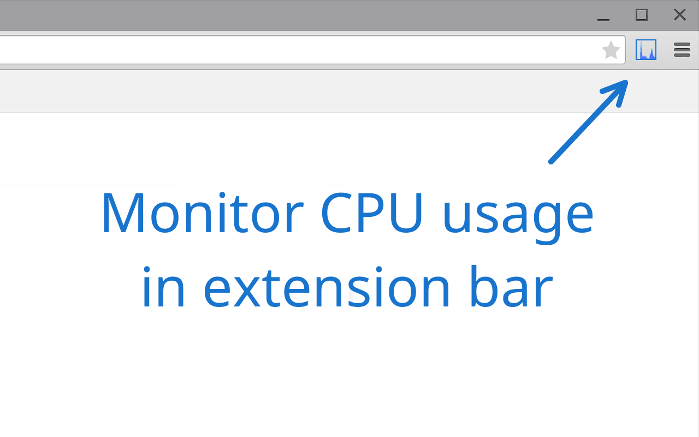
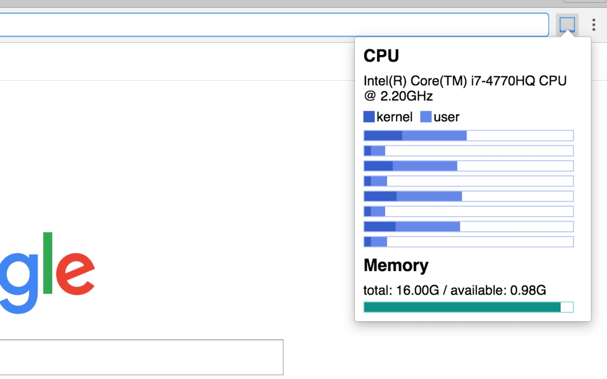

# System Monitor

Monitor CPU and memory status in Chrome

## Install

Install it from Chrome Web Store:

https://chrome.google.com/webstore/detail/system-monitor/ecmlflnkenbdjfocclindonmigndecla

## License

MIT
